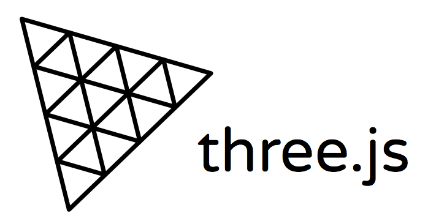

# Hi there, I'm Suporno. Gm 👋 

## I'm a smart contract dev with an interest in AI

- 🏙️ I am based in Kolkata, India.
- 🛠️ I am building [Yieldhive](https://yieldhive.xyz) - the place with the best collection of DeFi strategies and Midas an agent which can do complex DeFi specific tasks 
- 👨‍💻 I am a smart contract developer but also do things in other parts of the web3 stack.
- ☕️ I am always open to have a chat with poeple curious around web3/tech/startups!

- 

### Connect with me:

&nbsp;&nbsp;

&nbsp;&nbsp;

### Languages and Tools:

          

          
          

          

          

                

          
          

 
 

  
:zap: GitHub Stats

  

